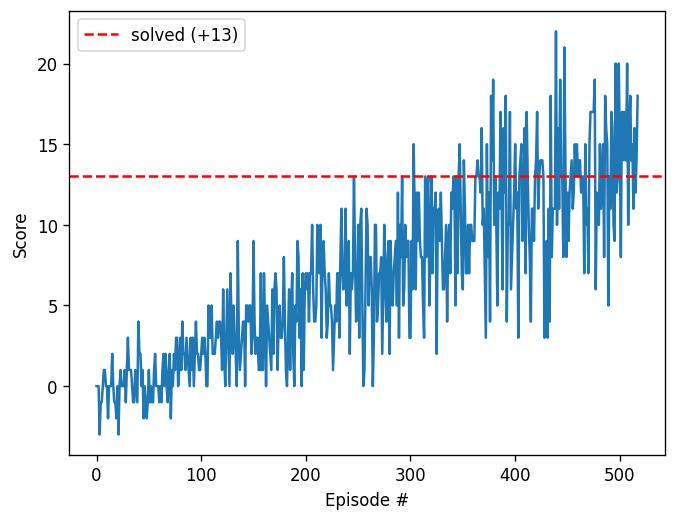

# Report — Navigation (Deep Q-Network)

## Learning Algorithm

The agent is trained with **Deep Q-Learning (DQN)** ([Mnih et al., 2015](https://www.nature.com/articles/nature14236)), a value-based method that uses a neural network to approximate the action-value function `Q(s, a)`. Two techniques from the original DQN paper are used to stabilise training:

1. **Experience Replay** — transitions `(s, a, r, s', done)` are stored in a fixed-size replay buffer. Mini-batches are sampled uniformly at random, which breaks the temporal correlation between consecutive samples and lets each transition be reused many times.
2. **Fixed Q-Targets** — a separate *target* network produces the TD targets. Its weights are updated slowly toward the *local* network via a soft update, which keeps the target from moving in lock-step with the predictions and reduces oscillation/divergence.

### Update rule

For each learning step the loss is the mean-squared TD error between the local network's prediction and the bootstrapped target:

```
Q_target  = r + γ · max_a' Q_target(s', a') · (1 − done)
loss      = MSE( Q_local(s, a) , Q_target )
```

The target network is then soft-updated:

```
θ_target ← τ · θ_local + (1 − τ) · θ_target
```

Actions are chosen with an **ε-greedy** policy: with probability `ε` a random action is taken (exploration), otherwise the greedy action `argmax_a Q_local(s, a)` is taken (exploitation). `ε` decays from `1.0` toward a small floor over the course of training.

### Algorithm outline

1. Initialise replay memory and the local/target Q-networks (identical weights).
2. For each episode: observe state `s`, pick action `a` (ε-greedy), step the env to get `r, s', done`, store the transition.
3. Every `UPDATE_EVERY` steps, if enough samples exist, sample a mini-batch and perform the gradient/soft-update step above.
4. Decay `ε`. Stop when the 100-episode moving average reaches `+13`.

## Network Architecture (`model.py`)

A simple fully-connected feed-forward network — sufficient because the 37-dim state is already a compact feature vector (no pixels):

| Layer | Size | Activation |
|:------|:-----|:-----------|
| Input | 37 (state) | — |
| Fully connected `fc1` | 64 | ReLU |
| Fully connected `fc2` | 64 | ReLU |
| Output `fc3` | 4 (action values) | linear |

## Hyperparameters (`dqn_agent.py`)

| Hyperparameter | Value | Meaning |
|:---------------|:------|:--------|
| `BUFFER_SIZE`  | 1e5   | replay buffer capacity |
| `BATCH_SIZE`   | 64    | minibatch size |
| `GAMMA`        | 0.99  | discount factor |
| `TAU`          | 1e-3  | soft-update interpolation |
| `LR`           | 5e-4  | Adam learning rate |
| `UPDATE_EVERY` | 4     | env steps between learning updates |
| `eps_start`    | 1.0   | initial exploration |
| `eps_end`      | 0.01  | minimum exploration |
| `eps_decay`    | 0.995 | per-episode ε decay |

## Results

The agent was trained in the Udacity GPU Workspace and **solved the environment in 418 episodes** — the average score over the 100-episode window ending at episode 518 first reached `+13` (final 100-episode average: **13.02**). The trained weights are saved in `checkpoint.pth`.

Progress during training (100-episode moving average):

| Episode | Avg score |
|:-------:|:---------:|
| 100 | 0.52 |
| 200 | 3.45 |
| 300 | 6.57 |
| 400 | 10.04 |
| 500 | 12.35 |
| 518 | **13.02** ✅ solved |

Plot of score per episode (the dashed line marks the `+13` solved threshold):



The curve shows the expected DQN learning dynamics: scores start near zero (and occasionally negative) while the agent explores randomly, then climb steadily as the replay buffer fills and the Q-network learns to distinguish yellow from blue bananas, finally fluctuating around 13–17 once a competent policy is found.

> **Note (validation of the implementation):** the identical `Agent`/`QNetwork` code in this repo was verified end-to-end on OpenAI Gym's **LunarLander** (the same DQN exercise from the Deep Q-Networks lesson), where it solved the task in **678 episodes** and scored a mean of **225** over 10 greedy evaluation episodes. Only `state_size` (8→37) and `action_size` (both 4) differ for the Banana task.

## Ideas for Future Work

- **Double DQN** — decouple action selection from evaluation to reduce the over-estimation bias of the `max` operator.
- **Prioritized Experience Replay** — sample transitions in proportion to their TD error so the agent learns more from surprising/informative experiences.
- **Dueling DQN** — split the network into separate state-value `V(s)` and advantage `A(s, a)` streams, which helps when the action choice matters little in many states.
- **Rainbow** — combine the above with multi-step returns, distributional RL, and noisy nets.
- **Learning from pixels** — solve the harder visual version of the environment with a convolutional front-end on the raw screen.
- **Hyperparameter tuning** — systematically search learning rate, network width/depth, and ε-decay schedule to reduce the episodes-to-solve.
